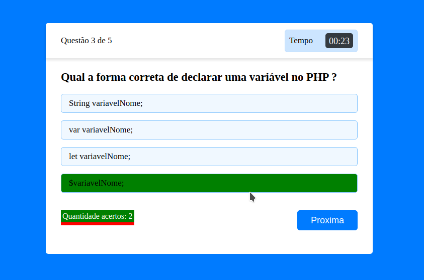
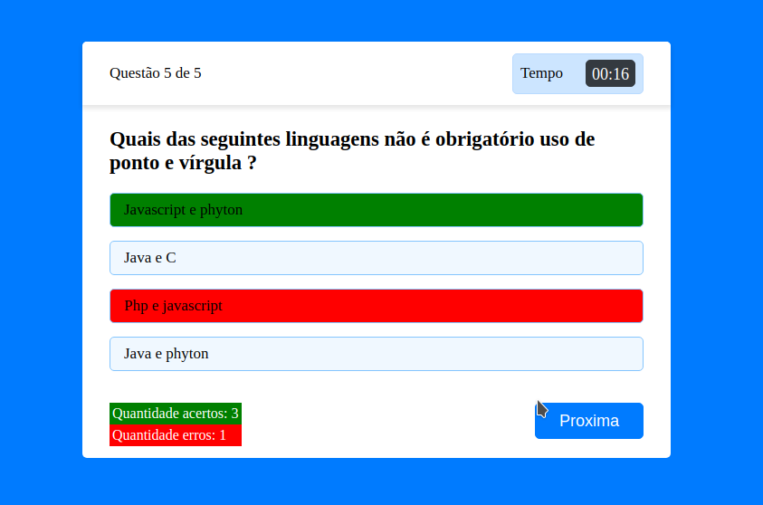

# Quiz-javascript
 <h3>Projeto web de um quiz utilizando html, css e javascript</h3>
 <figure>
    
	 <figcaption>Exemplo de acertos</figcaption>
</figure>
<figure>
    
    <figcaption>Exemplo de erro</figcaption>
</figure>