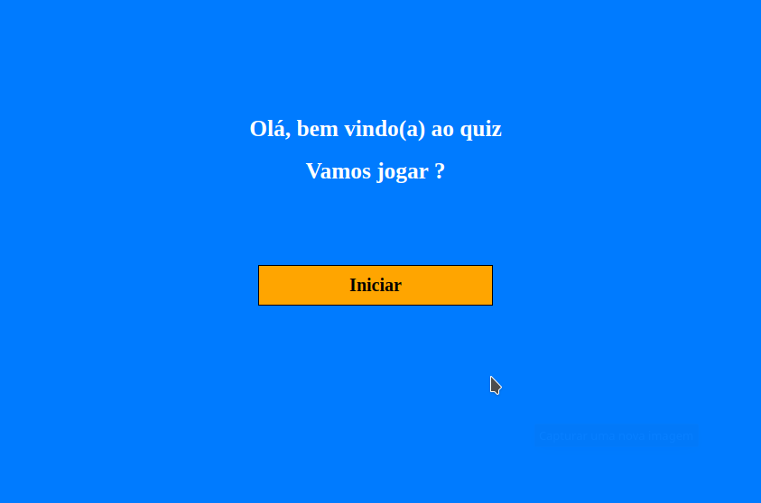

# Quiz-javascript
 <h3>Projeto web de um quiz utilizando html, css e javascript</h3>
 
 <figure>
 	<figcaption>Exemplo de acerto</figcaption>
    
</figure>
<figure>
	<figcaption>Exemplo de erro</figcaption>
    
</figure>